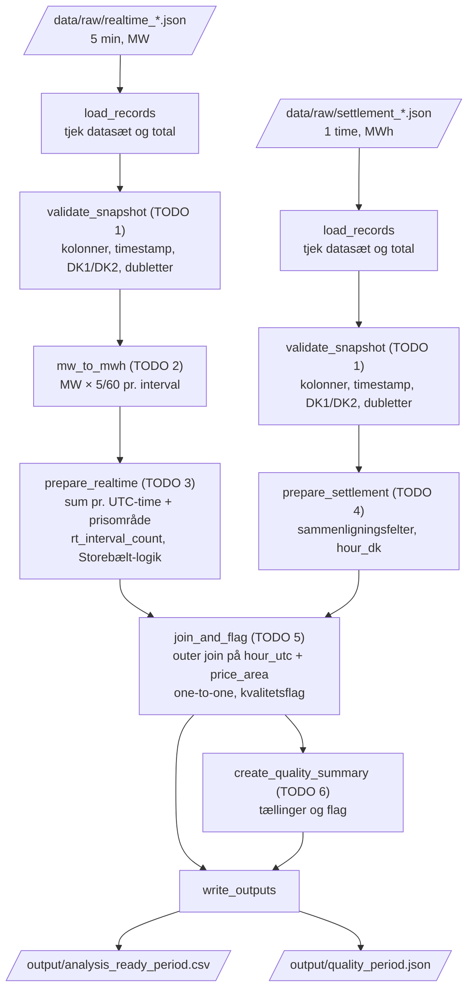

# Caseopgave – Kan vi stole på live-eldata?

## Problem

En flot livegraf kan se præcis ud, selv om de bagvedliggende data er foreløbige. Du skal undersøge, hvor godt operationelle femminuttersdata kan omsættes til analyseklare timedata, og hvordan de adskiller sig fra Energinets senere afregningsdata.

Målet er ikke at bevise, at én kilde altid er rigtig. Målet er at bygge en gennemsigtig pipeline og kunne forklare, hvornår data er gode nok til en bestemt anvendelse.

## Fælles minimumsløsning

Din pipeline skal:

1. læse rå JSON uden at ændre originalfilerne;
2. kontrollere datasætnavn, obligatoriske kolonner og entydige nøgler;
3. konvertere femminuttersværdier fra MW til MWh;
4. aggregere realtime-data til én række pr. UTC-time og prisområde;
5. kontrollere, om en realtime-time har præcis 12 intervaller;
6. danne mindst vind-, sol-, udvekslings- og loadrelaterede sammenligningsfelter;
7. behandle Storebælt forskelligt i udenlandsk udveksling og prisområdebalance;
8. sammenkoble realtime og afregning på `(hour_utc, price_area)`;
9. bevare rækker med problemer og tilføje læsbare kvalitetsflag;
10. skrive et analyseklart CSV-output og en kort kvalitetsrapport;
11. kunne genkøres fra start med én kommando;
12. dokumentere antagelser, fravalg og kendte begrænsninger.

## Dagsplan og checkpoints

### Dag 1 – Kilder, grain og rådata

Arbejdsopgaver:

- Kør `check_setup.py`.
- Undersøg ét realtime- og ét afregningssnapshot.
- Find grain, nøgler, tidskolonner, enheder og prisområder.
- Læs de to metadatafiler, især beskrivelser og advarsler.
- Tegn din planlagte pipeline fra raw til analyseklart output.
- Vælg foreløbigt tre undersøgelsesspørgsmål fra spørgsmålsbanken.

Checkpoint:

- Et kildeskema med kilde, grain, nøgle, enhed og forventede problemer.
- En pipelineskitse.
- `check_setup.py` viser `SETUP PASS`.

## kildeskema:
| | Realtime | Afregning |
|---|---|---|
| Kilde | Energinet ElectricityProdex5MinRealtime | Energinet ProductionConsumptionSettlement |
| Karakter | Operationelle, foreløbige data | Senere, modnede data |
| Grain | 5 min pr. prisområde | 1 time pr. prisområde |
| Nøgle | (Minutes5UTC, PriceArea) | (HourUTC, PriceArea) |
| Tidskolonner | Minutes5UTC, Minutes5DK | HourUTC, HourDK |
| Prisområder | DK1, DK2 | DK1, DK2 |
| Enhed | MW (effekt) | MWh (effekt pr. time) |
| Storebælt | ExchangeGreatBelt | ExchangeGreatBelt_MWh |
| Records (DST-snapshot) | 1704 (71 timer × 12 × 2 områder) | 142 (71 timer × 2 områder) |
>

# Pipelineskitse

# Big Data – de 5 V'er

| V | Betydning | I casen |
|---|---|---|
| **Volume** | Mængden af data | Snapshots er små (ca. 7 MB pr. måned). Det løbende system er stort: 5-minutters data siden 2015 og timedata siden 2005, for mange datasæt. |
| **Velocity** | Hvor hurtigt data kommer, og hvor hurtigt de skal bruges | Realtime opdateres hvert 5. minut. Afregning opdateres dagligt med 9-15 dages forsinkelse. |
| **Variety** | Forskellige formater og strukturer | JSON, forskellige kolonneopdelinger og enheder (MW/MWh), forskellige definitioner af load, flere datasæt. |
| **Veracity** | Hvor pålidelige data er | Realtime har kendte fejl, som ikke rettes. Afregning er ca. 99 % korrekt efter 15 dage. |
| **Value** | Hvad data kan bruges til | Drift og overblik (realtime), afregning og statistik (afregning). Værdien afhænger af, om kvaliteten er god nok til formålet. |

### Modul02 – Validering, MW→MWh og timer

Arbejdsopgaver:

- Implementér `TODO 1–3` i `src/pipeline.py`.
- Afvis dubletter på den sammensatte primærnøgle og uventede kolonnebrud tydeligt.
- Omregn hvert femminuttersinterval med `MW × 5/60` efter caseantagelsen i `DATAORDLISTE.md`. Forklar dette metodeforbehold i din eksisterende kildedokumentation; beregnet realtime-MWh er et sammenligningsgrundlag, ikke officiel afregning.
- Aggregér på UTC-time og prisområde.
- Bevar antal intervaller pr. time.
- Start med `--period dst`, og gå derefter til januar.
- Brug `--stage realtime` til Modul02-checkpointet. Det gemmer mellemoutput uden at kræve TODO 4–6.

Checkpoint:

- En realtime-tabel med én række pr. UTC-time og prisområde.
- En dokumenteret kontrol af, at sommertidsdøgnet ikke får en kunstig ekstra time.
- En liste over ufuldstændige timer.

> Dokumentation og bevis for alle tre punkter: se [docs/dst_kontrol.md](docs/dst_kontrol.md)

### Modul03 – Afregning, join og kvalitetsflag

Arbejdsopgaver:

- Implementér `TODO 4–6`.
- Dan sammenlignelige felter i afregningsdata.
- Udfør et one-to-one outer join.
- Tilføj kvalitetsflag frem for at slette problemrækker.
- Skriv analyseklart CSV og en kort maskinlæsbar kvalitetsrapport.
- Kør januar, juni og sommertidsperioden.

Checkpoint:

- Ét analyseklart output pr. periode.
- Oversigt over joinstatus, ufuldstændige timer, negative værdier og andre fund.
- Forklaring af Storebælt-logikken.

### Modul04 – Undersøgelse og Big Data-perspektiv

Arbejdsopgaver:

- Besvar mindst tre spørgsmål fra spørgsmålsbanken eller egne godkendte spørgsmål.
- Sammenlign mindst to perioder eller prisområder.
- Brug både en samlet måling og konkrete timer som evidens.
- Forklar casen med mindst fire relevante Big Data-karakteristika.
- Lav caseopgaven om platform, ansvar og sikkerhed nedenfor.

Checkpoint:

- Tre foreløbige svar med tabeller eller visualiseringer.
- Et kort Big Data-notat.
- Et begrundet platform- og ansvarsvalg.

### Modul05 – Reproducerbarhed og faglig forklaring

Arbejdsopgaver:

- Genkør projektet fra en tom `output`-mappe.
- Kontrollér output og skriv dine sidste antagelser og begrænsninger.
- Færdiggør præsentation eller demonstration.
- Forbered en individuel forklaring af én transformation og ét kvalitetsfund.

Checkpoint:

- Reproducerbar pipeline og analyseklart output.
- Kort README eller driftsvejledning.
- Tre besvarede undersøgelsesspørgsmål.
- Faglig demonstration med dokumenteret evidens.

## Spørgsmålsbank

Vælg mindst tre. Du må formulere dine egne, hvis de kan besvares med data og godkendes af underviseren.

1. Er realtime-data lige anvendelige i vinter og sommer?
2. Hvilke produktionstyper har de største absolutte og relative afvigelser?
3. Er forskellen mellem realtime og afregning den samme i DK1 og DK2?
4. Kan mistænkeligt uændrede værdier opdages uden at kende afregningstallene?
5. Hvad sker der med analysen, hvis ufuldstændige timer behandles som normale timer?
6. Ændrer de største afvigelser sig, når kendte metadatafejl markeres særskilt?
7. Giver soldata samme konklusion, når self-consumption medregnes og ikke medregnes?
8. Kan en time have høj absolut afvigelse, men lav relativ betydning—eller omvendt?
9. Hvornår kunne realtime-data føre til en anden beslutning end de senere data?
10. Hvor stor en forskel gør korrekt Storebælt-logik for DK1/DK2-balancen?
11. Er korrelation nok til at sige, at to dataserier stemmer overens?
12. Hvilke kvalitetsproblemer kan findes alene med regler, og hvilke kræver domæneviden eller metadata?

## Caseopgave – Er dette Big Data?

Tag stilling til casen ud fra mindst fire relevante karakteristika, eksempelvis volume, velocity, variety, veracity, value og historik/revisioner.

Du skal skelne mellem:

- størrelsen på de udleverede undervisningssnapshots;
- det løbende produktionssystem, som de er et udsnit af.

En bestemt rækkegrænse er ikke i sig selv et tilstrækkeligt argument.

## Caseopgave – Platform, ansvar og sikkerhed

Sammenlign kort:

- den lokale offline-løsning i dette projekt;
- en tænkt løsning, hvor en underviser indsamler realtime-data løbende i en database og udstiller et internt API.

Beskriv:

- hvem der ejer indsamling, validering, adgang og rettelser;
- hvad der skal logges;
- hvordan API-nøgler og forbindelsesoplysninger bør beskyttes;
- om casen indeholder persondata;
- hvorfor GDPR stadig bør vurderes, selv når konklusionen er, at hoveddata ikke er persondata.

## Minimumsevidens ved aflevering

- kilde- og grainskema;
- pipelineskitse;
- kørbar kode;
- mindst ét mellemoutput og tre analyseklare periodeoutputs;
- kvalitetsrapport med tællinger og flag;
- mindst tre besvarede spørgsmål;
- Big Data-vurdering;
- platform-, ansvars- og sikkerhedsvurdering;
- dokumenterede antagelser og begrænsninger;
- kort individuel forklaring eller demonstration.

## Kvalitetskriterier

En stærk løsning er ikke den med flest linjer kode. Den:

- gør grain og enheder tydelige;
- kan genkøres;
- fejler tydeligt på kontraktbrud;
- skjuler ikke dataproblemer;
- adskiller observation, antagelse og konklusion;
- forbinder tekniske valg med den analyse, data skal bruges til.

## Revisionsnote

Revision 1.1 afstemmer navigationen med Modul01–Modul05 og adskiller caseopgaver fra fælles miniopgaver på separate eksempeldata. Minimumsløsning og afleveringskrav er uændrede.

## Revisionshistorik

| Revision | Dato | Ændring |
|---|---|---|
| 1.4 | 21. september 2026 | Præciserer arbejdsrute og forklaringer uden nye casekrav. |
| 1.2 | 21. september 2026 | QA-001. |
| 1.3 | 21. september 2026 | Præciserer Modul01→Modul02-arbejdsruten og fagterminologi for primærnøgle/join key uden nye krav. |
